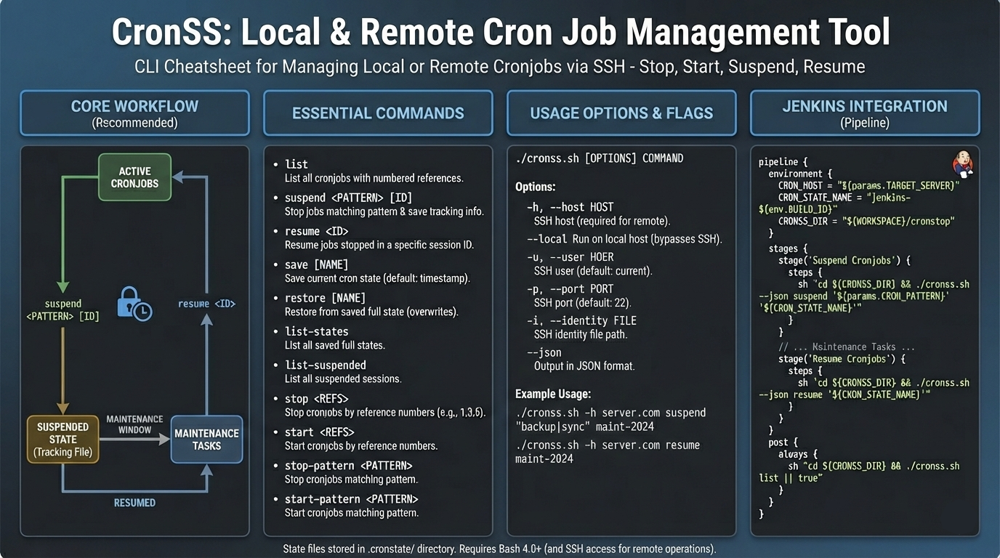

# CronSS (Cron Stop/Start) - Remote Cron Job Management Tool



A bash script for managing cronjobs on remote servers via SSH or locally. Allows you to list, stop, start, suspend, resume, and restore cronjobs while maintaining state history.

Perfect for use in Jenkins pipelines, maintenance windows, and automated deployments.

## Features

- **Docker Support**: Manage cronjobs inside running containers (new!)
- **Live Demo**: Interactive built-in demonstration (new!)
- **State Tracking**: Suspend specific jobs and resume them later (new!)
- **Local Mode**: Manage cronjobs on the current machine without SSH (new!)
- **List**: List all cronjobs with numbered references
- **Save/Restore**: Save full cron state before making changes
- **Stop/Start**: Toggle specific cronjobs by reference number or pattern
- **Patterns**: Regex-based matching for automation (e.g., "backup\.sh")
- **Jenkins Ready**: Environment variable support and JSON output
- **History**: State history management

## Quick Links

- [Jenkins Integration Guide](JENKINS.md) - Complete guide for using CronSS in Jenkins pipelines

## Installation

```bash
chmod +x cronss.sh
```

## Usage

```
./cronss.sh [OPTIONS] COMMAND
```

### Options

- `-h, --host HOST` - SSH host (or use CRON_HOST env var)
- `-u, --user USER` - SSH user (or use CRON_USER env var, default: current user)
- `-p, --port PORT` - SSH port (or use CRON_PORT env var, default: 22)
- `-i, --identity FILE` - SSH identity file (or use CRON_IDENTITY env var)
- `--docker CONTAINER` - Target a running Docker container (or use CRON_DOCKER_CONTAINER env var)
- `--local` - Run on local machine (bypasses SSH)
- `--json` - Output in JSON format (for Jenkins/automation)

### Commands

- `list` - List all cronjobs with reference numbers and show active suspended sessions
- `suspend <PATTERN> [ID]` - Stop jobs matching pattern and save tracking info
- `suspend-guarded <PATTERN> <MINUTES> [ID]` - Suspend jobs with an auto-revert safety net on the remote host
- `resume <ID>` - Resume jobs that were stopped in a specific session ID
- `save [NAME]` - Save current cron state (default: timestamp)
- `restore [NAME]` - Restore from saved full state
- `stop <REFS>` - Stop cronjobs by reference numbers
- `start <REFS>` - Start cronjobs by reference numbers
- `stop-pattern <PATTERN>` - Stop cronjobs matching pattern
- `start-pattern <PATTERN>` - Start cronjobs matching pattern
- `stop-all` - Stop ALL cronjobs
- `start-all` - Start ALL cronjobs
- `list-states` - List all saved full states
- `list-suspended` - List all suspended sessions
- `demo` - Run an interactive live demo using a temporary Docker container

## Safe Maintenance Mode (Dead Man's Switch)

If your deployment pipeline crashes or network connectivity is lost after suspending cronjobs, the remote server could be left in a suspended state indefinitely.

`suspend-guarded` prevents this by scheduling an automatic revert on the remote server itself.

```bash
# Suspend jobs matching "backup", but automatically revert changes in 30 minutes if not manually resumed
./cronss.sh -h server.com suspend-guarded "backup" 30 maintenance-ID
```

**How it works:**
1.  Saves the current crontab to a temporary file *on the remote server* (e.g., `/tmp/cronss_safe_ID.cron`).
2.  Calculates the revert time (Now + 30 mins) using the remote server's clock.
3.  Injects a self-destruct job into the active crontab:
    ```
    45 10 * * * crontab /tmp/cronss_safe_ID.cron && rm /tmp/cronss_safe_ID.cron
    ```
4.  If you run `./cronss.sh resume maintenance-ID` successfully before the timeout, the safety job is removed along with the other changes.
5.  If you *don't* resume in time, the remote server executes the restore command automatically.

## Maintenance Window Workflow (Recommended)

The recommended workflow for maintenance is using `suspend` and `resume`. This ensures only the jobs you stopped are restarted, preserving any other changes made during the window.

1. **Suspend jobs**:
   ```bash
   ./cronss.sh -h server.com suspend "backup|sync" maintenance-2024
   ```
   This stops enabled jobs matching "backup" or "sync" and saves them to a tracking file with ID `maintenance-2024`.

2. **Perform Maintenance**:
   Run your updates, deployments, etc.

3. **Resume jobs**:
   ```bash
   ./cronss.sh -h server.com resume maintenance-2024
   ```
   This restarts only the jobs that were stopped in step 1.

## Examples

### Live Demo

Experience the tool in action with a single command (requires Docker):
```bash
./cronss.sh demo
```

### Docker Container

Manage cronjobs inside a running container:
```bash
# List cronjobs in a container
./cronss.sh --docker my-db-container list

# Suspend jobs in a container
./cronss.sh --docker my-db-container suspend "backup" maintenance-window
```

### List all cronjobs (Remote)

```bash
./cronss.sh -h server.example.com list
```

### List all cronjobs (Local)

```bash
./cronss.sh --local list
```

### Manual Stop/Start

Stop specific jobs by reference:
```bash
./cronss.sh -h server.example.com stop 1,3,5
```

Stop by pattern:
```bash
./cronss.sh -h server.example.com stop-pattern "backup"
```

### Full State Backup/Restore

Save everything before a risky operation:
```bash
./cronss.sh -h server.example.com save backup-full
```

Restore everything (overwrites current crontab):
```bash
./cronss.sh -h server.example.com restore backup-full
```

### Jenkins Integration

```bash
export CRON_HOST=server.example.com
export CRON_STATE_NAME=build-${BUILD_ID}

# Best Practice: Suspend with auto-revert (30 min timeout)
./cronss.sh suspend-guarded "backup" 30 "${CRON_STATE_NAME}"

# ... build/deploy ...

# Resume jobs (disarms safety switch)
./cronss.sh resume "${CRON_STATE_NAME}"
```

## State Files

State files are stored in `.cronstate/` directory:
- Full backups: `{hostname}_{username}_{name}.cron`
- Suspend sessions: `{hostname}_{username}_{id}.suspend`

## Requirements

- Bash 4.0+
- SSH access to remote server (unless using `--local`)
- `crontab` command available

## License


This software is **Proprietary** and not open-source.
Rodrigo Marras
